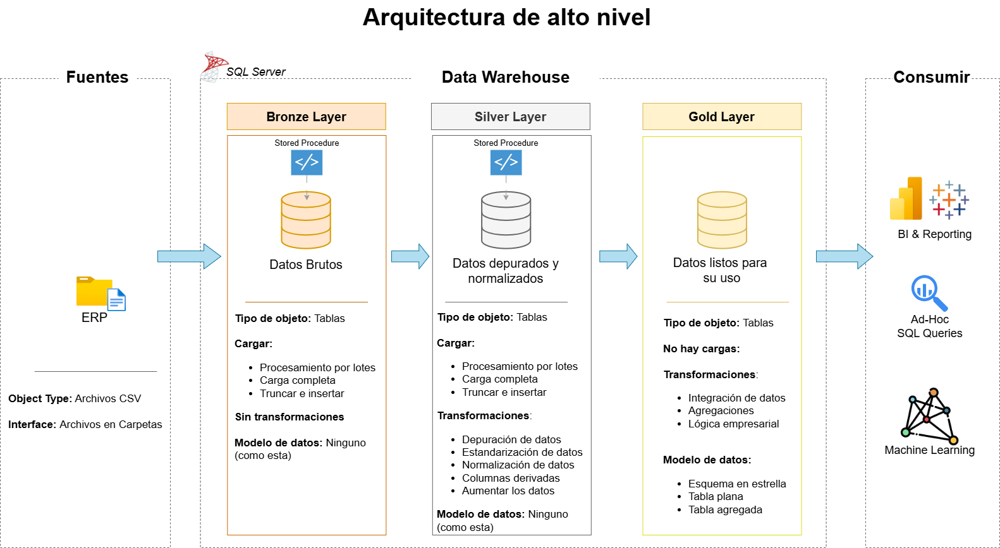

# Proyecto Data Warehouse de Ventas

¡Bienvenido al repositorio **Proyecto Data Warehouse de Ventas**! 🚀

Este proyecto muestra una solución completa de almacenamiento y análisis de datos, desde la creación del Data Warehouse hasta la generación de información util, aplicando las mejores prácticas de la industria en ingeniería y análisis de datos.

---
## 🏗️ Arquitectura de Datos

La arquitectura de datos para este proyecto sigue las capas **Bronce**, **Plata** y **Oro** de la Arquitectura del Medallón:

1. **Bronze Layer**: Almacena los datos sin procesar de los sistemas de origen. Los datos se introducen desde archivos CSV en una base de datos SQL Server.
2. **Silver Layer**: Esta capa incluye procesos de limpieza de datos, estandarización y normalización para preparar los datos para el análisis.
3. **Gold Layer**: Alberga los datos listos para el negocio modelados en un esquema en estrella necesario para la elaboración de informes y análisis.

---

## 🚀 Requerimientos del Proyecto

### Construccion del Data Warehouse (Ingenieria de Datos)

#### Objetivo
Desarrollar un Data Warehouse utilizando SQL Server para consolidar los datos de ventas, lo que permitirá la elaboración de informes analíticos y la toma de decisiones basadas en información.

#### Especificaciones
- **Fuentes de datos**: Importar datos de dos sistemas fuente (ERP) proporcionados en archivos CSV.
- **Calidad de datos**: Limpiar y resolver problemas de calidad de datos antes del análisis.
- **Integración**: Combinar ambas fuentes en un único modelo de datos fácil de usar, diseñado para consultas analíticas.
- **Alcance**: Enfocarse únicamente en el conjunto de datos más reciente; no se requiere historización de datos.
- **Documentación**: Proporcionar documentación clara del modelo de datos para apoyar tanto a los interesados del negocio como a los equipos de análisis.

---
